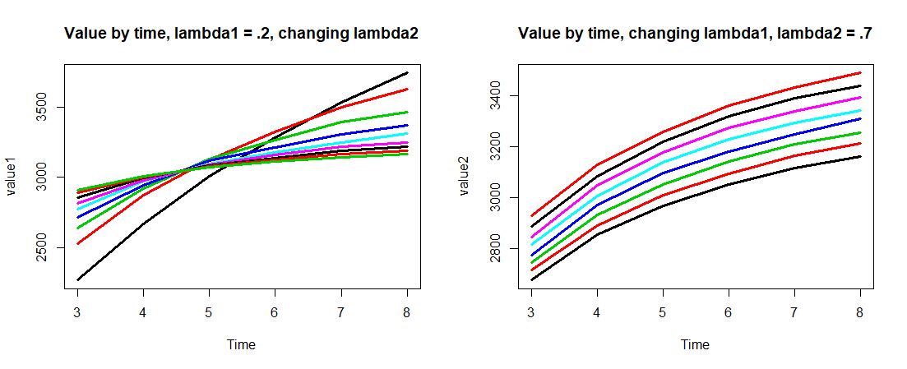
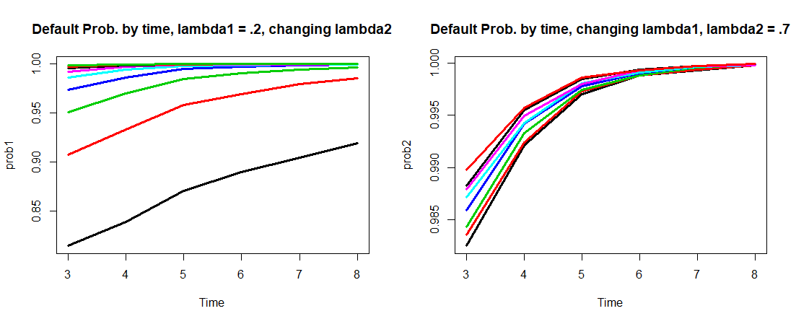
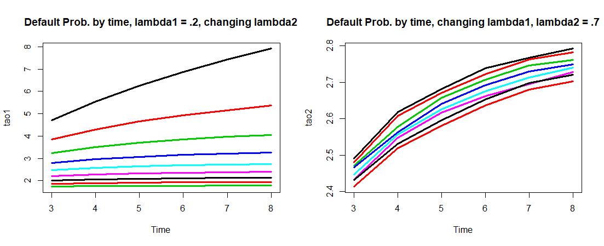

## Functions
```{R}
# Zhao_Yanxiang_Projcet6
########################### FUNCTIONS ########################### 
# function to simulate stock prices
sPaths <- function(s0, r, sigma, t, nSim, n){
  dt <- t/n
  sim <- list()
  for (i in 1:(nSim/2)){
    dw <- sqrt(dt)*rnorm(n)
    s_sim1 <- rep(s0,n)
    s_sim2 <- rep(s0,n)
    for (s in 2:n){
      # create anthithetic paths
      s_sim1[s] <- s_sim1[s-1]*(1 + r*dt + sigma*dw[s])
      s_sim2[s] <- s_sim2[s-1]*(1 + r*dt - sigma*dw[s])
    }
    sim_i <- list(s_sim1, s_sim2)
    sim <- append(sim, sim_i)
  }
  out <- matrix(unlist(sim), nSim, n, byrow = T)
  return(out)  
}
```
### Question 1 Functions
```{R}
##### QUESTION 1 #####
# function to price fixed strike lookback options
fsLookback <- function(s0, x, r, sigma, t, nSim, n, type){
  paths <- sPaths(s0, r, sigma, t, nSim, n)
  if (type == "call"){
    maxS <- apply(paths, 1, max)
    v <- exp(-r*t)*mean(ifelse(maxS>x, maxS-x, 0))
  }
  else if (type == "put"){
    minS <- apply(paths, 1, min)
    v <- exp(-r*t)*mean(ifelse(x>minS, x-minS, 0))
  }
  else {
    stop("Incorrect option type!")
  }
  return(v)
}
```
### Question 2 Functions
```{R, eval = FALSE}
##### Question 2 #####
# function to simulate callateral values
vPaths <- function(v0, mu, sigma, gamma, t, lambda1, nSim, n){
  dt <- t/n
  sim <- list()
  for (i in 1:(nSim/2)){
    dw <- sqrt(dt)*rnorm(n)
    dj <- dt*rpois(n, lambda1)
    v_sim1 <- rep(v0,n)
    v_sim2 <- rep(v0,n)
    for (s in 2:n){
      # create anthithetic paths
      v_sim1[s] <- v_sim1[s-1]*(1 + mu*dt + sigma*dw[s] + gamma*dj[s])
      v_sim2[s] <- v_sim2[s-1]*(1 + mu*dt - sigma*dw[s] + gamma*dj[s])
    }
    sim_i <- list(v_sim1, v_sim2)
    sim <- append(sim, sim_i)
  }
  out <- matrix(unlist(sim), nSim, n, byrow = T)
  return(out) 
}
# function to price default option
defaultOption <- function(paths, lambda2, t, L0, r0, delta, alpha, epsilon){
  n <- ncol(paths)
  m <- nrow(paths)
  mons <- t*12
  # find r
  r <- (r0+delta*lambda2)/12
  # find pmt
  pmt <- (L0*r)/(1-(1/(1+r))^mons)
  # find Lt
  a <- pmt/r
  b <- pmt/(r*(1+r)^mons)
  c <- 1+r
  Lt_mon <- a-b*c^(0:mons)
  # find qt
  beta <- (epsilon-alpha)/t
  qt_mon <- alpha + beta*(0:mons)
  # use linear interpolation for continuous loan values
  Lt <- approx(seq(0,n,n/mons), Lt_mon, n=n)[[2]]
  qt <- approx(seq(0,n,n/mons), qt_mon, n=n)[[2]]
  # find Nt
  Nt <- matrix(rpois(n*m, lambda2), m, n, byrow = T)
  # find Q
  Q <- unlist(apply(paths, 1, function(x) which(x<=qt*Lt)[1]))
  # find S
  S <- unlist(apply(Nt, 1, function(x) which(x>0)[1]))
  # find value of default option, default prob, and avg default time
  option <- vector()
  tao <- vector()
  for (i in 1:m){
    if (!is.na(Q[i])&!is.na(S[i])){
      # if Q happens before S
      if (Q[i]<=S[i]){
        option[i] <- max(Lt[Q[i]]-epsilon*paths[i,Q[i]], 0)
        tao[i] <- Q[i]
      }
      # if S happens before Q
      else{
        option[i] <- abs(Lt[S[i]]-epsilon*paths[i,S[i]])
        tao[i] <- S[i]
      }
    }
    # if only Q happens
    else if (!is.na(Q[i])){
      option[i] <- max(Lt[Q[i]]-epsilon*paths[i,Q[i]], 0)
      tao[i] <- Q[i]
    }
    # if only S happens
    else if (!is.na(S[i])){
      option[i] <- abs(Lt[S[i]]-epsilon*paths[i,S[i]])
      tao[i] <- S[i]
    }
    # if no default happens
    else {
      option[i] <- 0
      tao[i] <- NA
    }
  }
  prob <- sum(option!=0)/m
  # return
  return(c(value = mean(option), prob = prob, tao =mean(tao, na.rm = T)))
}
```
## Question 1
```{R}
##### Question 1 #####
# set parameters
s0 <- 98
x <- 100
r <- .03
t <- 1
sigma <- seq(.12, .48, .04)
nSim <- 10000
n <- 200
type <- c("call", "put")
# run simulation
q1 <- rep(list(rep(0,length(sigma))),2)
for (i in 1:2){
  for (j in 1:length(sigma)){
    q1[[i]][j] <- fsLookback(s0, x, r, sigma[j], t, nSim, n, type[i])
  }
}
```
# plot
```{R}
plot(sigma, q1[[1]], type = "l", lwd = 3, col = "firebrick2",
     main = "Fixed Strike Lookback Call and Put", xlab = "Price")
lines(sigma, q1[[2]], type = "l", lwd = 3, col = "dodgerblue4")
legend("bottomright", legend = c("call", "put"), lwd = 3, 
       col = c("firebrick2", "dodgerblue4"))
```
  

## Question 2
```{R, eval = FALSE}
##### Question 2 #####
# set parameters
lambda1 <- seq(0.05, 0.4, 0.05)
lambda2 <- seq(0, 0.8, 0.1)
t <- 3:8
v0 <- 20000
L0 <- 22000
r0 <- .02
mu <- -.1
sigma <- .2
gamma <- -.4
delta <- .25
alpha <- .7
epsilon <- .95
nSim <- 100000
n <- t*12
# run simulations
default <- rep(list(rep(list(rep(list(),length(lambda2))),length(lambda1))),length(t))
for (s in 1:length(t)){
  for (i in 1:length(lambda1)){
    paths <- vPaths(v0, mu, sigma, gamma, t[s], lambda1[i], nSim, n[s])
    for (j in 1:length(lambda2)){
      cat("s=",s, " i=",i, " j=",j,"\n")
      default[[s]][[i]][[j]] <- defaultOption(paths, lambda2[j], t[s], L0, r0, delta, alpha, epsilon)
    }
  }
}
# output values
default[[which(t==5)]][[which(lambda1==.2)]][[which(lambda2==.4)]]
```
### Values: 
For $\lambda_1 = .2, \lambda_2 = .4, T = 5$:  
       prob        tao 
Value of the default option = 3097.23015
Prob. of default            = 0.99778    
Expected time of default    = 2.64121   

### Plots:
```{R, eval = FALSE}
# plots
# (a)
value1 <- diag(0, length(t), length(lambda2))
for (s in 1:length(t)){
  for (j in 1:length(lambda2)) {
    value1[s,j] <- default[[s]][[which(lambda1==.2)]][[j]][1]
  }
}
value2 <- diag(0, length(t), length(lambda1))
for (s in 1:length(t)){
  for (i in 1:length(lambda1)) {
    value2[s,i] <- default[[s]][[i]][[which(lambda2==0.4)]][1]
  }
}
par(mfrow=c(1,2))
matplot(matrix(t,6,9), value1, type ="l", lwd = 3, lty=1, xlab = "Time", main = "Value by time, lambda1 = .2, changing lambda2")
matplot(matrix(t,6,8), value2, type ="l", lwd = 3, lty=1, xlab = "Time", main = "Value by time, changing lambda1, lambda2 = .7")

# (b)
prob1 <- diag(0, length(t), length(lambda2))
for (s in 1:length(t)){
  for (j in 1:length(lambda2)) {
    prob1[s,j] <- default[[s]][[which(lambda1==.2)]][[j]][2]
  }
}
prob2 <- diag(0, length(t), length(lambda1))
for (s in 1:length(t)){
  for (i in 1:length(lambda1)) {
    prob2[s,i] <- default[[s]][[i]][[which(lambda2==0.4)]][2]
  }
}
par(mfrow=c(1,2))
matplot(matrix(t,6,9), prob1, type ="l", lwd = 3, lty=1, xlab = "Time", main = "Default Prob. by time, lambda1 = .2, changing lambda2")
matplot(matrix(t,6,8), prob2, type ="l", lwd = 3, lty=1, xlab = "Time", main = "Default Prob. by time, changing lambda1, lambda2 = .7")

# (c)
tao1 <- diag(0, length(t), length(lambda2))
for (s in 1:length(t)){
  for (j in 1:length(lambda2)) {
    tao1[s,j] <- default[[s]][[which(lambda1==.2)]][[j]][3]
  }
}
tao2 <- diag(0, length(t), length(lambda1))
for (s in 1:length(t)){
  for (i in 1:length(lambda1)) {
    tao2[s,i] <- default[[s]][[i]][[which(lambda2==0.4)]][3]
  }
}
par(mfrow=c(1,2))
matplot(matrix(t,6,9), tao1, type ="l", lwd = 3, lty=1, xlab = "Time", main = "Default Prob. by time, lambda1 = .2, changing lambda2")
matplot(matrix(t,6,8), tao2, type ="l", lwd = 3, lty=1, xlab = "Time", main = "Default Prob. by time, changing lambda1, lambda2 = .7")
```


